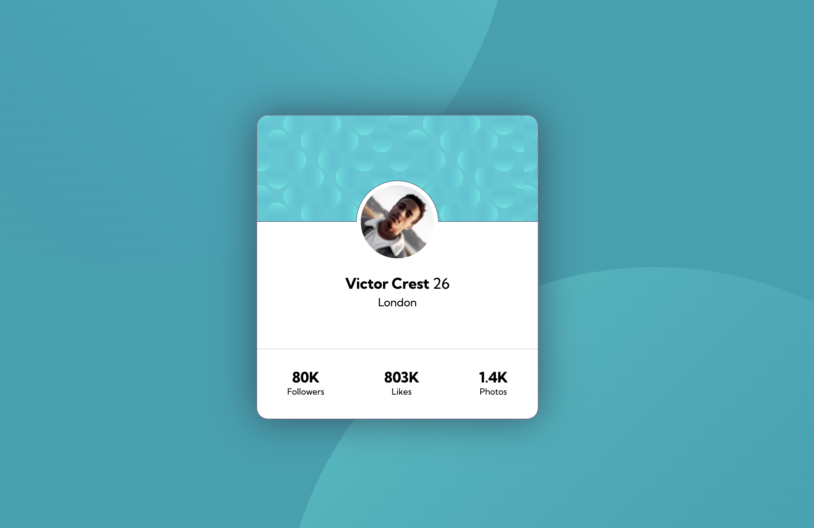

Made a simple profile card to sharpen up on my CSS.  Probably will add some changes to it later.

## Table of contents

- [Screenshot](#screenshot)
- [Links](#links)
- [Built with](#built-with)
- [Useful resources](#useful-resources)
- [Author](#author)

### Screenshot

### Links

- Live Site URL: [Add live site URL here](https://fanciful-pony-e9734e.netlify.app/)

## My process

### Built with

- Semantic HTML5 markup
- CSS custom properties
- Flexbox

### Useful resources

- [Atomic Object](https://spin.atomicobject.com/2015/04/07/css-multiple-backgrounds/) - This helped me to understand how to use multiple svg background in css.

## Author

- Twitter - [@nicholasherious](https://www.twitter.com/nicholasherious)

